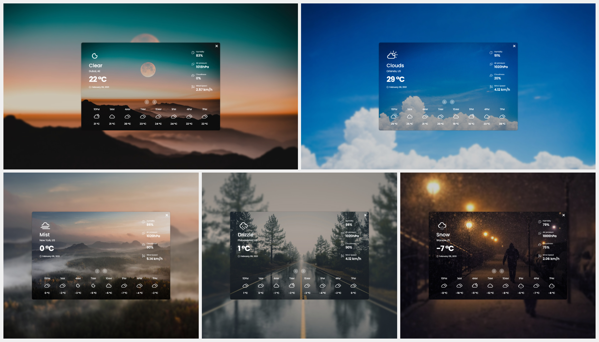

# Weather-API-JS

## Project prupose

The website was created for a larger project called ["Front-end-foundations".](https://github.com/KoTubA/Front-end-foundations)



## Live demo

Link to demo: https://kotuba.github.io/Weather-API-JS/

## How to run?

**1. Clone this repository:**
```
git clone https://github.com/KoTubA/Weather-API-JS.git
```

or:

```
git clone git@github.com:KoTubA/Weather-API-JS.git
```

## How to use?


The project uses [AccuWeather APIs.](https://developer.accuweather.com/) In order to use the site, you need to create an account and add a new application. The next step is to replace the application key in the `main.js` file.

````JavaScript
const api = {
    key: "my_api_key"
}
````


## Project status

The project has been completed and will no longer be developed in the future.
